<div align="center">



<br>

[](https://www.hanmanthpatil.me/)
[](https://www.linkedin.com/in/hanmanthpatil/)
[](https://github.com/HanmanthPatil)

</div>
---

## About Me

I build intelligent systems that turn ideas into working solutions.

I'm a B.E. student in Artificial Intelligence & Machine Learning at **Shetty Institute of Technology**, with hands-on experience across **AI/ML, software engineering, cybersecurity, robotics, IoT, and digital product design**.

My work spans AI-powered cybersecurity, intelligent agriculture, roadside assistance, marketplaces, smart transportation, industrial platforms, and competitive robotics.

> **Got a problem worth solving? Let's solve it and engineer the intelligence behind it.**

---

## Tech Stack

### AI / ML

<div align="left">


</div>

`Machine Learning` `Deep Learning` `NLP` `Computer Vision` `Generative AI`

### Software / Web

<div align="left">


</div>

`REST APIs` `Web Applications` `Full-Stack Development`

### Backend / DevOps

<div align="left">


</div>

`API Development` `Containerization` `Version Control`

### Robotics / IoT

<div align="left">


</div>

`Robotics` `IoT` `Embedded Systems` `GPS` `Sensors` `Automation`

### Design

<div align="left">


</div>

`UI/UX Design` `Product Design` `Digital Experiences`

---

## Featured Projects

### 🛡️ PHISHGUARD 2.0

AI-powered cybersecurity platform that analyzes URLs, messages, files, and images to detect phishing and malicious content and generate centralized risk assessments.

**Focus:** AI · Cybersecurity · NLP · Threat Detection · FastAPI · Docker

---

### ⚙️ EquipLease

Industrial equipment rental platform connecting equipment owners with renters through equipment discovery and rental workflows.

**Focus:** Product Design · UI/UX · Web Development · Software Engineering

---

### 🚗 RoadResQ

Intelligent roadside assistance platform connecting vehicle owners with suitable mechanics based on expertise, equipment, availability, and real-time needs.

**Focus:** AI · Intelligent Systems · Web Development · Product Design

---

### 🌱 Agri Sahayak

AI-powered agricultural platform combining plant disease diagnosis with a smart farming assistant to support farmers with crop health and farming decisions.

**Focus:** AI · Machine Learning · Computer Vision · Agriculture Technology

---

### 📍 NearByNest (NBN)

Nearby buyers marketplace connecting farmers and local sellers with buyers to improve direct access to local markets.

**Focus:** Marketplace · Web Development · Product Design

---

### 🚌 YatraTrack

Rural and urban bus-tracking system designed to provide real-time bus location and tracking information for smarter public transportation.

**Selected for:** NAIN

**Focus:** IoT · GPS · Embedded Systems · Real-Time Tracking

---

## Robotics

`RoboRace` · `RoboSoccer` · `Line Following Robot` · `Maze Solver` · `RoboSumo` · `RoboWar` · `Obstacle Avoider`

---

## Achievements

🏆 **4 × 1st Prize**  
🥈 **3 × 2nd Prize**  
🥉 **2 × 3rd Prize**

### Selected Wins

- 🥇 **1st Prize** — TECH X, ComedKares — UI/UX Design Challenge
- 🥇 **1st Prize** — TechFusionn'24 — Line Following
- 🥇 **1st Prize** — NIT Trichy — Robo Soccer
- 🥇 **1st Prize** — SIH Internal Hackathon 2026
- 🥈 **2nd Prize** — !!ENGINEER'24!!, NIT Karnataka — Line Following
- 🥈 **2nd Prize** — TechFusionn'24 — Robusta Line Following
- 🥈 **2nd Prize** — AVIRAT '25, SBR College — RoboRace
- 🥉 **3rd Prize** — TechFusionn'24 — RoboRace
- 🥉 **3rd Prize** — INEX Tumkur — Idea Pitching

---

## Leadership

### Bits and Bots
**Co-Founder & Head of Team Management**  
December 2024 – Present

Multidisciplinary student technology ecosystem working across robotics, AI, software, IoT, UI/UX, and innovation.

### Sports Club — Shetty Institute of Technology
**Vice President**  
December 2025 – Present

---

## Certifications

- **Prompt Engineering** — Great Learning
- **Career Essentials in Generative AI** — Microsoft & LinkedIn
- **Career Essentials in GitHub Professional Certificate** — GitHub & LinkedIn
- **Career Essentials in Sustainable Tech** — Microsoft & LinkedIn
- **Career Essentials in Cybersecurity** — Microsoft & LinkedIn
- **TestMu AI Software Testing Professional Certification** — TestMu AI

---

## Current Focus

```text
AI / ML              → Intelligent systems & applied AI
Software             → Scalable applications & product engineering
Cybersecurity        → Phishing & threat detection
Robotics             → Autonomous & competition robotics
IoT                  → Connected intelligent systems
Product Design       → Useful, intuitive digital experiences
